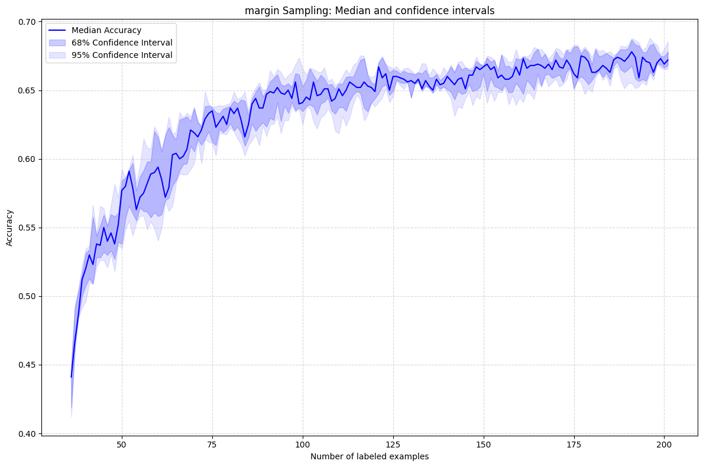

# Active Learning Core Concepts

## Why Active Learning?
In traditional machine learning, labeled data is a prerequisite for training models. However, obtaining labeled data can be resource-intensive, especially in domains like healthcare or natural language processing. Active learning addresses this challenge by strategically selecting the most informative data points for labeling, significantly reducing the amount of labeled data needed while maintaining or even improving model performance.

This project explores the principles of active learning through the **Forest Covertype Dataset**, using various query strategies to demonstrate its impact on model performance and data efficiency.

---

## Data Analysis

### Dataset
The [Forest Covertype Dataset](https://archive.ics.uci.edu/dataset/31/covertype) is a multi-class dataset containing features derived from cartographic variables to predict forest cover types. We visualized this dataset in 2D using Principal Component Analysis (PCA) to reduce dimensionality for better understanding.

### Visualization


The scatter plot shows the distribution of the dataset after PCA transformation. Different classes are highlighted, and initial labeled samples are marked with black borders.

**Total samples**: 11,000  
**Training samples**: 10,000  
**Test samples**: 1,000  
**Initially labeled samples**: 35  
**Unlabeled pool size**: 9,965

### Performance Gap
To assess the potential for active learning, we compared model performance when trained on:
1. A **small initial labeled set** (e.g., 35 samples).
2. The **entire training dataset** (10,000 samples).


The significant performance gap between these scenarios highlights the opportunity for active learning to optimize model training with minimal labeled data.

---

## Query Strategies

We implemented the following active learning strategies to evaluate their effectiveness:
- **Uncertainty Sampling**: Selects data points with the highest uncertainty.
  - Least Confident
  - Margin Sampling
  - Entropy Sampling
- **Query-by-Committee (QBC)**: Measures disagreement among an ensemble of models.
- **Random Sampling**: A baseline for comparison.

---

## Confidence Intervals for Query Strategies

To evaluate the robustness of each query strategy, we repeated the active learning loop **5 times** and plotted the median accuracy along with the **68% (±1σ)** and **95% (±2σ)** confidence intervals.

### Query-by-Committee (QBC)
QBC measures the disagreement among a committee of models trained on bootstrapped subsets of the labeled data.


---

### Entropy Sampling
Entropy sampling selects the points with the highest information-theoretic uncertainty, calculated as the entropy of predicted probabilities.


---

### Margin Sampling
Margin sampling selects points where the difference between the top two predicted probabilities is smallest, indicating uncertainty.



---

### Random Sampling
Random sampling serves as a baseline, selecting points from the unlabeled pool without any strategy.


---

### Combined Comparison
To provide a holistic view, we plotted the learning curves of all strategies together. This visualization shows the progression of accuracy as more labeled examples are acquired.


---

## Observations
1. **QBC and Entropy Sampling**: These strategies perform well in the early stages when the labeled dataset is small. They effectively minimize the labeling cost.
2. **Margin Sampling**: Performs competitively but is slightly less robust compared to QBC and Entropy Sampling.
3. **Random Sampling**: As expected, Random Sampling shows the least improvement over time but serves as a useful baseline.
4. **Variance Analysis**: Confidence intervals indicate that QBC has slightly more variance compared to other methods, reflecting the variability in committee-based approaches.

---

## Installation and Usage

### Prerequisites
- Python >= 3.8
- Install required dependencies:
  ```bash
  pip install -r requirements.txt
  ```

### Running the Project
Execute the main script to run the analysis:
```bash
python main.py
```

---

## Contribution
Feel free to submit issues or pull requests to improve the project.

## License
MIT License
